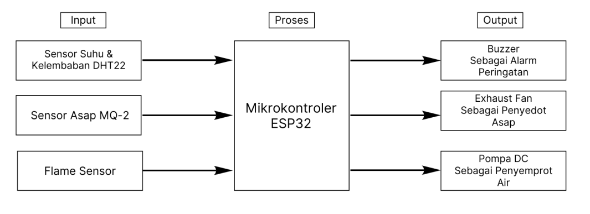
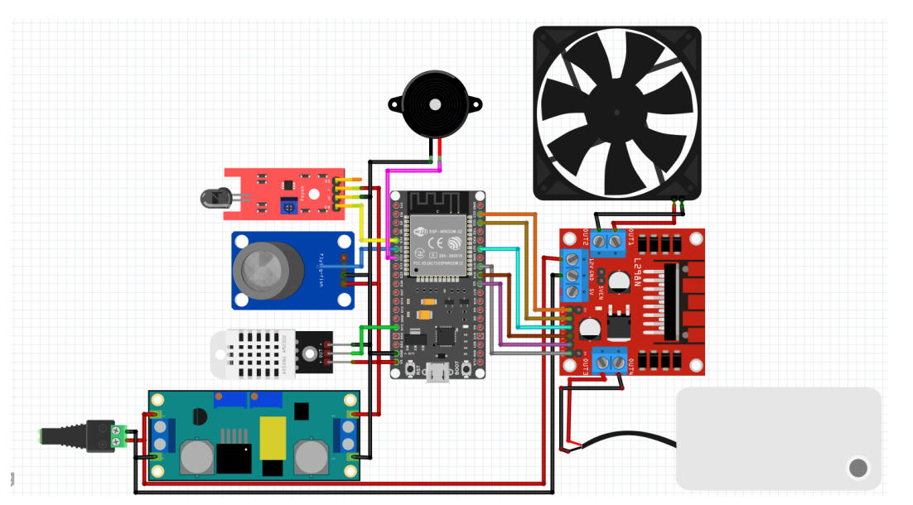
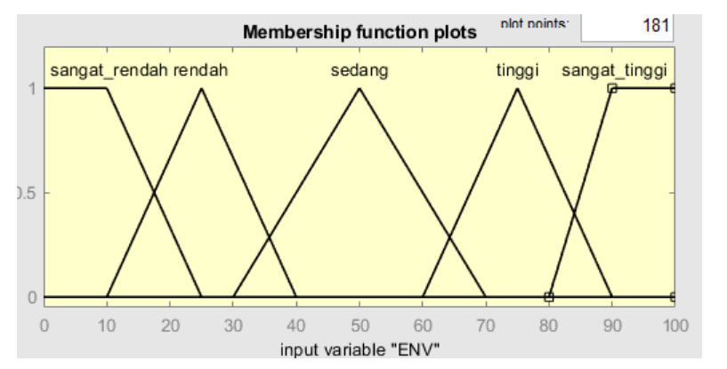
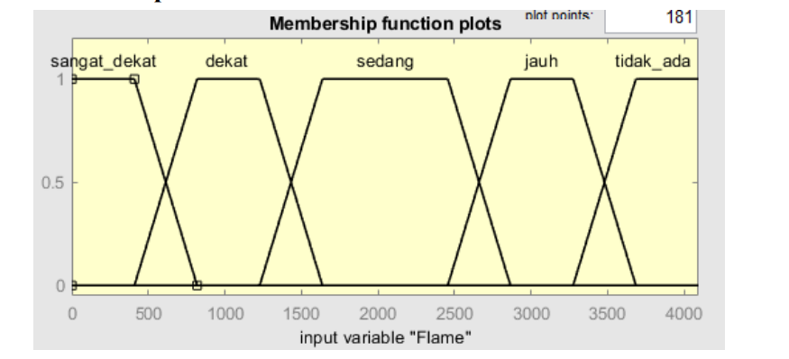
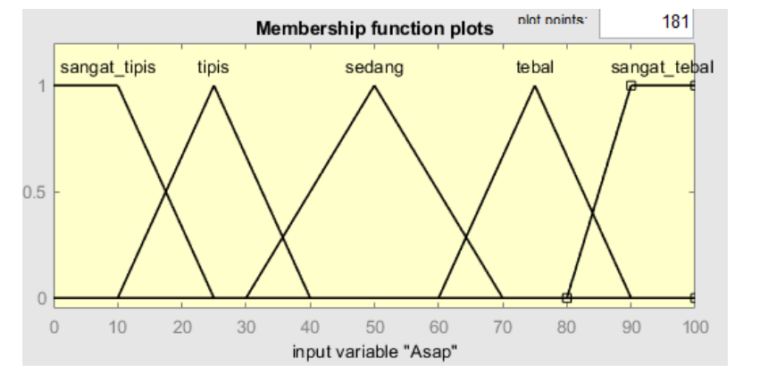
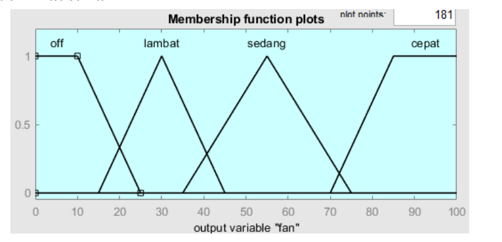
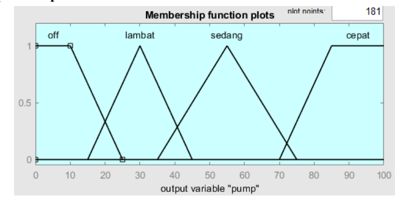
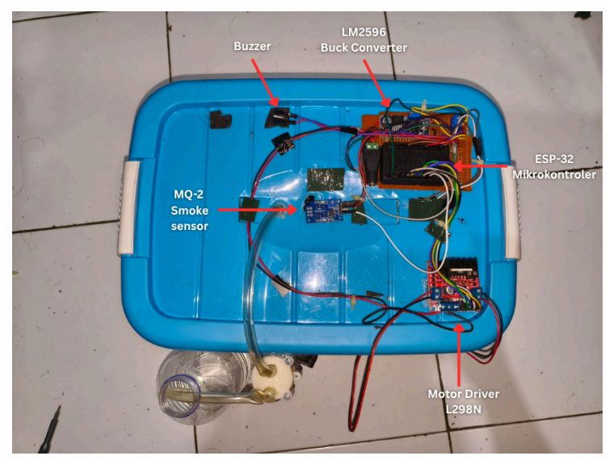
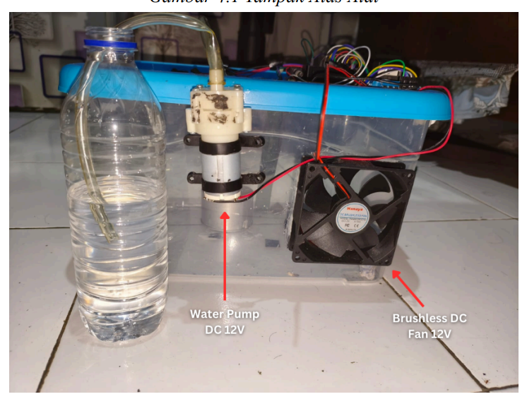
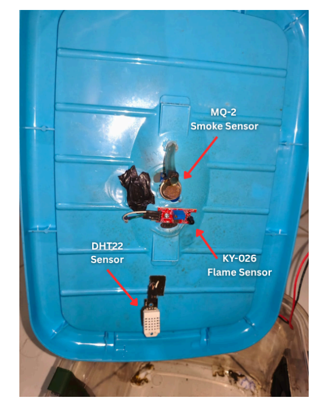

# 🔥 Fuzzy Logic-Based Automatic Fire Suppression System

An early fire detection & suppression system that combines **three sensors** (temperature/humidity, smoke, and flame) with **Mamdani fuzzy logic** to make more adaptive decisions than a conventional on/off system. Instead of simply switching actuators on once a threshold is crossed, the system computes the *urgency level* of the environmental conditions and proportionally adjusts the exhaust fan and water pump speeds — plus a buzzer alarm for early warning.

Built on the **ESP32**, with the entire fuzzy inference engine (fuzzification → 125-rule rule base → centroid defuzzification) computed *on-the-fly* directly on the microcontroller, with no static lookup table.

---

## 🧩 System Architecture

The system follows an **Input → Process → Output** flow:



| Input | Process | Output |
|---|---|---|
| DHT22 Temperature & Humidity Sensor | ESP32 Microcontroller (Mamdani Fuzzy) | Buzzer (warning alarm) |
| MQ-2 Smoke Sensor | | Exhaust Fan (smoke extraction) |
| Flame Sensor (KY-026) | | DC Water Pump (water spray) |

---

## 🛠️ Hardware Components

| Component | Function |
|---|---|
| **ESP32 (ESP-WROOM-32)** | Main microcontroller, runs the fuzzy inference engine |
| **DHT22** | Air temperature & humidity sensor |
| **MQ-2** | Smoke / flammable gas concentration sensor |
| **KY-026 Flame Sensor** | Detects flame presence & distance (infrared) |
| **L298N Motor Driver** | Controls fan & pump speed via PWM |
| **12V DC Fan (Brushless)** | Exhaust for extracting/diluting smoke |
| **12V DC Water Pump** | Sprays water toward the fire source |
| **Active Buzzer** | Early warning alarm |
| **LM2596 Buck Converter** | Steps down the source voltage to component operating levels |

---

## 🔌 Wiring Schematic



> Full connection diagram between the sensors, ESP32, L298N motor driver, and actuators. See also [Pin Configuration](#-pin-configuration) for the exact pin assignments used in the code.

---

## 🧠 Fuzzy Logic Design

The system uses a **Mamdani-type Fuzzy Inference System (FIS)** with:

- **3 input variables**: `ENV` (combined temperature + humidity), `Flame` (flame distance), `Asap`/Smoke (smoke concentration)
- **2 output variables**: `fan` (exhaust fan speed), `pump` (water pump speed)
- **125 rules** (5 × 5 × 5, full combination of the 5 fuzzy sets per input)
- **Methods**: AND = min, OR = max, Implication = min, Aggregation = max, Defuzzification = **centroid (COG)**

The original FIS design file (can be opened in **MATLAB Fuzzy Logic Toolbox** / the `fuzzy` app) is available at [`fuzzy_design/fuzzy-system.fis`](fuzzy_design/fuzzy-system.fis).

### Membership Functions

<table>
<tr>
<td><b>Input: ENV (Temperature + Humidity)</b></td>
<td><b>Input: Flame (Flame Distance)</b></td>
</tr>
<tr>
<td></td>
<td></td>
</tr>
<tr>
<td><b>Input: Smoke (Smoke Concentration)</b></td>
<td><b>Output: Fan</b></td>
</tr>
<tr>
<td></td>
<td></td>
</tr>
<tr>
<td><b>Output: Pump</b></td>
<td></td>
</tr>
<tr>
<td></td>
<td></td>
</tr>
</table>

**ENV preprocessing weight**: 70% temperature + 30% humidity (inverted — the more humid, the lower the ENV score), since temperature is considered the more dominant indicator of fire risk.

> 📝 **Note**: the membership function screenshots above are direct exports from the MATLAB Fuzzy Logic Toolbox, so their axis labels are still in Indonesian (`sangat_rendah` = very low, `rendah` = low, `sedang` = medium, `tinggi` = high, `sangat_tinggi` = very high; `sangat_dekat` = very close, `dekat` = close, `jauh` = far, `tidak_ada` = none; `sangat_tipis` = very thin, `tipis` = thin, `tebal` = thick, `sangat_tebal` = very thick; `lambat` = slow, `cepat` = fast). The updated `.fis` file in this repo already uses the English labels — re-open it in MATLAB and re-export the plots if you'd like fully English screenshots.

**Implementation note**: In the ESP32 firmware, every membership function and the entire rule base is re-implemented natively in C++ (no external library), so the inference + centroid defuzzification can be computed *in real time* without the memory overhead of a large lookup table.

---

## 🔧 Prototype

<table>
<tr>
<td><br><i>Top view — electronics control</i></td>
<td><br><i>Actuators: water pump & exhaust fan</i></td>
</tr>
<tr>
<td colspan="2" align="center"><br><i>Sensor placement on the container lid</i></td>
</tr>
</table>

---

## 📁 Repository Structure

```
.
├── firmware/
│   └── fuzzy_fire_system.ino     # Main ESP32 code (fuzzy inference engine)
├── fuzzy_design/
│   └── fuzzy-system.fis        # FIS design file (MATLAB Fuzzy Logic Toolbox)
├── docs/
│   ├── images/
│   │   ├── 01_block_diagram.png
│   │   ├── 02_wiring_schematic.png
│   │   ├── 03_prototype_top_labeled.png
│   │   ├── 04_prototype_side.png
│   │   └── 05_prototype_sensors_labeled.png
│   └── membership_functions/
│       ├── mf_env.png
│       ├── mf_flame.png
│       ├── mf_smoke.png
│       ├── mf_output_fan.png
│       └── mf_output_pump.png
├── .gitignore
└── README.md
```

---

## 🚀 Getting Started

### Prerequisites

- [Arduino IDE](https://www.arduino.cc/en/software) or PlatformIO
- **ESP32** board package (esp32 by Espressif Systems) installed
- **DHT sensor library** (Adafruit) and its dependency (Adafruit Unified Sensor)

### Steps

1. Download `firmware/fuzzy_fire_system.ino`
2. Open `firmware/fuzzy_fire_system.ino` in the Arduino IDE.
3. Select the **ESP32 Dev Module** board and the appropriate serial port.
4. Make sure the wiring matches the [schematic](docs/images/02_wiring_schematic.png) and the [pin configuration](#-pin-configuration) below.
5. Upload the sketch to the board.
6. Open the Serial Monitor (baud rate **115200**) to view real-time logs: sensor readings, fuzzification results, and fan/pump output.

> ⏱️ **Note**: The MQ-2 requires a warm-up period (defined via `MQ2_WARMUP_MS`) before its smoke reading is considered valid.

---

## 📌 Pin Configuration

| Function | ESP32 Pin |
|---|---|
| Flame Sensor (analog) | GPIO 33 |
| MQ-2 Smoke Sensor (analog) | GPIO 35 |
| DHT22 Data | GPIO 4 |
| Buzzer | GPIO 23 |
| Fan — ENA (PWM) | GPIO 25 |
| Fan — IN1 | GPIO 26 |
| Fan — IN2 | GPIO 27 |
| Pump — ENB (PWM) | GPIO 14 |
| Pump — IN3 | GPIO 12 |
| Pump — IN4 | GPIO 13 |

---

## 🎛️ Sensor Filtering Details

To keep readings stable before they enter the fuzzification stage:

- **Flame sensor**: uses a **Median filter (window 5)** combined with a **Moving Average (window 5)** to reject noise spikes while smoothing the signal, with an effective latency of ±400 ms.
- **MQ-2**: read directly from the ADC (a Low-Pass Filter option exists in the code but is currently disabled, since its noise characteristics are more gradual).
- **PWM output**: the defuzzification result (0–100%) is remapped to the PWM range (0–255) with a **deadzone** below 11.5% (actuator considered off), along with a brief **kick-start** mechanism (170 PWM for 300 ms) to overcome the *stall torque* when the motor/pump starts from a standstill.

---

## 📄 License

See the [LICENSE](LICENSE) file for details.

---

## 🙋 Contributors

- Yunachz — [GitHub](https://github.com/Yunachz)
